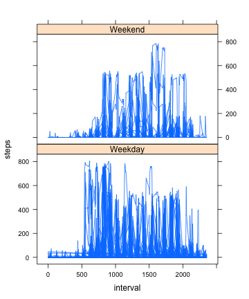

## Importing, Tracking, and Plotting Activity Data ##

### Loading and Preprocessing the Data ###

Below, after downloading the file, I read the csv file into a variable    
called "activity_data". I then used the complete.cases function to remove the NAs  
and only use complete cases for the next question, convert it to a data table    
so I can use dplyr functions, and then change the date column so all the items    
are in date format.  


```r
activity_data <- read.csv("activity.csv", colClasses = c("numeric", "character", "numeric"))
activity_data_complete <- activity_data[complete.cases(activity_data),]
library(data.table)
library(dplyr)
activity_dataDT <- as.data.table(activity_data_complete)
activity_dataWithDate <- mutate(activity_dataDT, date = as.POSIXct(date, format = "%Y-%m-%d"))
```
### What is the mean total number of steps per day? ###

To create a histogram of total number of steps taken each day, I first used   
an aggregate function to get the sum of the total steps taken on each date.   
Then I created a simple histogram with the total steps on the x-axis.  


```r
stepsPerDay <- aggregate(steps ~ date, data=activity_dataWithDate, sum)
```

```r
hist(stepsPerDay$steps, main = "Steps Per Day", xlab = "steps per day")
```

 
  
To find the mean number of steps, I took the result of my aggregate function  
that summed the steps and used the mean function. I then did the same thing  
with the median function to calculate medianSteps.


```r
meanSteps <- mean(stepsPerDay$steps)
medianSteps <- median(stepsPerDay$steps)
print(meanSteps)
```

```
## [1] 10766.19
```

```r
print(medianSteps)
```

```
## [1] 10765
```
### What is the average daily activity pattern? ###

For step 1, I first calculated average steps per interval using an aggregate  
function. Then I plotted the average steps calculated against the interval. 


```r
stepsPerInterval <- aggregate(steps ~ interval, data=activity_dataWithDate, mean)
```

```r
plot(stepsPerInterval$interval, stepsPerInterval$steps, type="l",ylab="avg number of steps", xlab="5 minute interval")
```

 
  
To get the 5 minute interval that contained the maximum number of steps, first I calculated    
the max steps using the max function, then converted stepsPerInterval into a data table,  
then filtered the row that contained that max number, storing it in a variable.  


```r
maxSteps <- max(stepsPerInterval$steps)
stepsPerIntervalDT <- as.data.table(stepsPerInterval)
intervalMaxFilter <- filter(stepsPerIntervalDT, steps == maxSteps)
intervalMax <- intervalMaxFilter$interval
```

The interval with the maximum number of steps is:  


```
## [1] 835
```

### Inputting Missing Values ###

To calculate the number of missing values, I used the sum and is.na functions  
to count the number of rows with NAs. 


```r
numOfMissingRows <- sum(is.na(activity_data))
```

The total number of rows with NAs is:  


```r
print(numOfMissingRows)
```

```
## [1] 2304
```

I then took the original data frame and converted it to a data table,  
this time with the missing values, and converted the date column  
from character to date class. 


```r
activity_dataDTWNA <- as.data.table(activity_data)
activity_dataWithDateWNA <- mutate(activity_dataDTWNA, date = as.POSIXct(date, format = "%Y-%m-%d"))
```

My strategy to fill in the missing values was to take the data table, group it by interval,  
and take the mean of the non NA values per interval and use that to fill in the NAs for steps.  


```r
activity_dataWithDateWNA%>% 
        group_by(interval) %>%
        mutate(steps = replace(steps, is.na(steps), mean(steps, na.rm= TRUE)))
```

```
## Source: local data table [17,568 x 3]
## Groups: interval
## 
##        steps       date interval
## 1   1.716981 2012-10-01        0
## 2   0.000000 2012-10-02        0
## 3   0.000000 2012-10-03        0
## 4  47.000000 2012-10-04        0
## 5   0.000000 2012-10-05        0
## 6   0.000000 2012-10-06        0
## 7   0.000000 2012-10-07        0
## 8   1.716981 2012-10-08        0
## 9   0.000000 2012-10-09        0
## 10 34.000000 2012-10-10        0
## ..       ...        ...      ...
```

With my new dataset, I then went through similar steps to above to create a histogram,  
this time with the missing values filled in. 


```r
stepsPerDayWNA <- aggregate(steps ~ date, data=activity_dataWithDateWNA, sum)
```


```r
hist(stepsPerDayWNA$steps, main = "Steps Per Day", xlab = "steps per day")
```

 

I then took similar steps to calculate the mean and the median. The mean was the same,  
which makes sense, because I was filling in values based on the mean per interval, but  
the median was different. The impact on estimates for total number of steps per day  
will depend on the strategy. For example,if I had decided to substitute 0 for NA,  
which might make sense if you assume missing data means no activity on that day,  
instead of substituting the mean for the interval, then the total number of steps would  
be the same as the total number calculated for the data without missing values.    


```r
meanStepsWNA <- mean(stepsPerDayWNA$steps)
medianStepsWNA <- median(stepsPerDayWNA$steps)
print(meanStepsWNA)
```

```
## [1] 10766.19
```

```r
print(medianStepsWNA)
```

```
## [1] 10765
```
### Are there differences in activity patterns between weekdays and weekends? ###

To understand this, first I changed the date column in my activity data to reflect days of the  
week, using the weekdays() and mutate() functions. Then I changed the date column into a factor,  
and then added levels to  reflect Monday - Friday being weekdays and Saturday and Sunday being weekends.  


```r
activity_days_of_week <- mutate(activity_dataWithDateWNA, date=weekdays(date))
activity_days_of_week_factor <- mutate(activity_days_of_week, date=factor(date))
levels(activity_days_of_week_factor$date) <- c("Weekday", "Weekday", "Weekend", "Weekend", "Weekday", "Weekday", "Weekday")
```

I then plotted interval on the x axis but number of steps on the y axis, separated out into two panels,  
one for weekend, and one for weekday. There do seem to be differences in that on weekends, there seem to be  
more steps later in the day than on weekdays.  


```r
library(lattice)
xyplot(steps ~ interval | date, data=activity_days_of_week_factor, layout = c(1, 2), type = "l")
```

 


